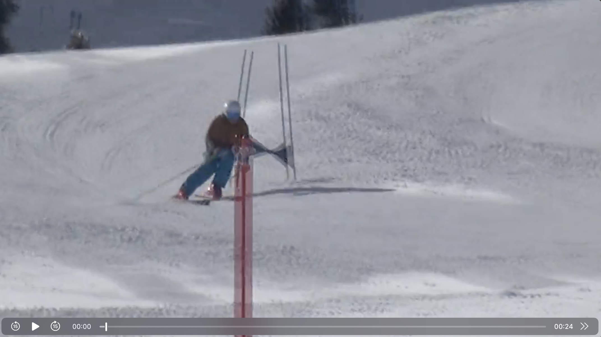
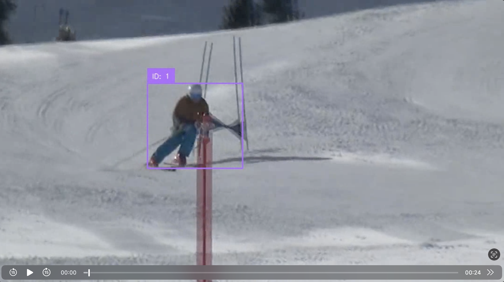

# Skier Detection and Tracking with YOLOv11

This project provides a high-performance Python script that uses YOLOv11 object detection to locate and track skiers in video files. The script processes videos frame-by-frame, identifies skiers, and draws persistent bounding boxes with unique tracker IDs using BoT-SORT or OC-SORT algorithms optimized for sports tracking.

## Visual Example

<table>
<tr>
<td align="center"><b>Before</b></td>
<td align="center"><b>After</b></td>
</tr>
<tr>
<td></td>
<td></td>
</tr>
</table>

## Features

- YOLOv11 Medium model for accurate person detection
- BoT-SORT algorithm (default) optimized for sports tracking
- OC-SORT algorithm as an alternative lightweight tracker
- GPU acceleration support (CUDA and Apple Silicon MPS)
- Automatic output file naming with `_with_box` suffix
- Configurable tracking parameters for different scenarios

## Installation

### 1. Clone the repository and navigate to the project directory
```bash
cd /path/to/poser
```

### 2. Create a Python virtual environment
```bash
python3 -m venv venv
```

### 3. Activate the virtual environment

**macOS/Linux:**
```bash
source venv/bin/activate
```

**Windows:**
```bash
venv\Scripts\activate
```

### 4. Install the required dependencies
```bash
pip install -r requirements.txt
```

This will install:
- `ultralytics` - YOLOv11 implementation
- `supervision` - Video processing and tracking
- `numpy` - Numerical operations
- `boxmot` - BoT-SORT and OC-SORT tracker implementations
- `torch` and `torchvision` - Deep learning framework

## First Run - Model Download

The YOLOv11 model will be automatically downloaded on the first run. The script uses `yolo11m.pt` (YOLOv11 Medium), which is approximately 51MB and will be saved in the project root directory.

When using BoT-SORT, the ReID model `osnet_x0_25_msmt17.pt` will also be downloaded automatically on first use.

## Usage

### Basic Command
```bash
python3 track_skier.py --source /path/to/your/video.mp4
```

### Examples
```bash
# Process a video with default BoT-SORT tracking
python3 track_skier.py --source ski_run.mp4

# Use lightweight OC-SORT tracker
python3 track_skier.py --source ski_run.mp4 --tracker ocsort

# Adjust tracking sensitivity for BoT-SORT
python3 track_skier.py --source ski_run.mp4 --track-high-thresh 0.7 --track-low-thresh 0.2

# Process a video with full path
python3 track_skier.py --source /Users/username/Videos/ski_competition.mov
```

### Command Line Options

- `--source`: Path to input video file (required)
- `--tracker`: Choose tracker algorithm: "botsort" (default) or "ocsort"
- `--track-high-thresh`: High confidence threshold for tracking (default: 0.6)
- `--track-low-thresh`: Low confidence threshold for tracking (default: 0.1)
- `--new-track-thresh`: Threshold for creating new tracks (default: 0.7)

### Output File

The output video will be saved in the **same directory** as the input file with `_with_box` added before the file extension.

**Examples:**
- Input: `ski_run.mp4` → Output: `ski_run_with_box.mp4`
- Input: `test-ski-video2.mov` → Output: `test-ski-video2_with_box.mov`
- Input: `/path/to/videos/alpine.mp4` → Output: `/path/to/videos/alpine_with_box.mp4`

## Tracker Comparison

### BoT-SORT (Default)
- **Best for**: Complex multi-person scenes, occlusions, and re-identification
- **Features**: Uses appearance features (ReID) for better tracking through occlusions
- **Trade-off**: Slightly slower but more accurate tracking

### OC-SORT
- **Best for**: Simple scenes with predictable motion
- **Features**: Lightweight, motion-based tracking without appearance features
- **Trade-off**: Faster but may struggle with occlusions

## What to Expect

When you run the script:

1. **First run**: The YOLOv11 and ReID models will download automatically (one-time download)
2. **Processing**: You'll see frame-by-frame detection results in the terminal
3. **Output**: Each detected person will have:
   - A bounding box drawn around them
   - A unique tracker ID (e.g., "ID: 1", "ID: 2")
   - Persistent tracking even if temporarily occluded

### Terminal Output Example
```
Loading YOLOv11 model (will auto-download if needed)...
Using device: mps
Using BotSort tracker
Processing video: ski_run.mp4
Output will be saved to: ski_run_with_box.mp4

0: 640x544 1 person, 1 skis, 45.2ms
0: 640x544 1 person, 1 skis, 43.6ms
...
Processing complete! Output saved to: ski_run_with_box.mp4
```

## Supported Video Formats

The script supports all common video formats including:
- `.mp4`
- `.mov`
- `.avi`
- `.mkv`
- `.webm`

## Performance Notes

The script is optimized for maximum tracking accuracy by:
- Using the YOLOv11 Medium model for better detection
- BoT-SORT with ReID for robust tracking through occlusions
- GPU acceleration when available (CUDA or Apple Silicon)

Processing speed depends on:
- Video resolution
- Number of people in the frame
- Hardware capabilities
- Chosen tracker (OC-SORT is faster than BoT-SORT)

## Troubleshooting

### Virtual Environment Not Activated
If you see "ModuleNotFoundError", ensure the virtual environment is activated:
```bash
source venv/bin/activate  # macOS/Linux
```

### Model Download Issues
If the model fails to download automatically, you can manually download it:
```bash
python3 -c "from ultralytics import YOLO; model = YOLO('yolo11m.pt')"
```

### Video Not Found
Ensure you're providing the correct path to your video file. Use absolute paths if relative paths don't work:
```bash
python3 track_skier.py --source /absolute/path/to/video.mp4
```

### Python Version Requirements
This project requires Python 3.10 or higher for the boxmot library to work correctly.