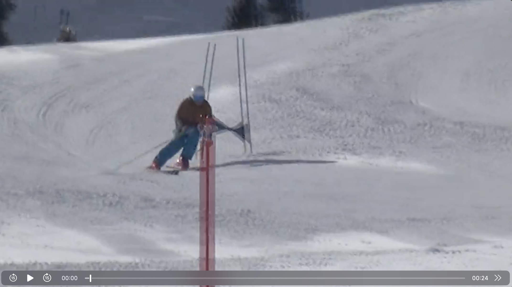
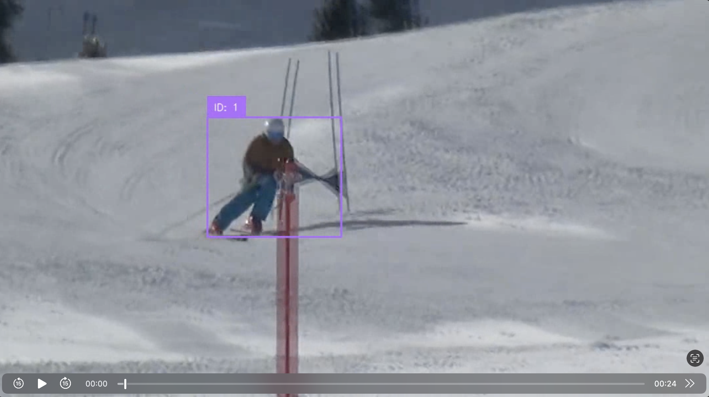
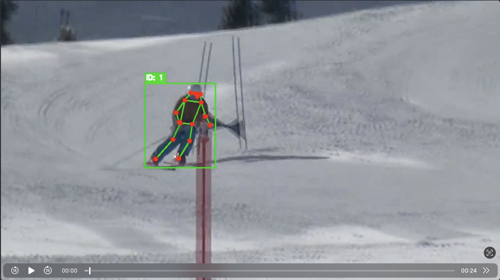

# Track-and-Pose: Modular Skier Analysis Pipeline

This project provides a modular Python pipeline for detecting, tracking, and analyzing skiers in video footage. It combines YOLOv11 object detection with BoT-SORT tracking and optional pose estimation to create detailed visualizations of skier movements.

## Visual Example

<table>
<tr>
<td align="center"><b>Original Frame</b></td>
<td align="center"><b>Object Tracking</b></td>
<td align="center"><b>Pose Estimation</b></td>
</tr>
<tr>
<td></td>
<td></td>
<td></td>
</tr>
</table>

## Features

- **Modular Design**: Run object detection only, pose estimation only, or both
- **Dual Pose Engines**: Choose between YOLOv11 Pose or MediaPipe Pose Landmarker
- **YOLOv11 Models**: Uses YOLOv11 Medium for object detection and YOLOv11 X-Large Pose for keypoint detection
- **Advanced Tracking**: BoT-SORT algorithm with ReID for robust sports tracking
- **GPU Acceleration**: Automatic detection and use of CUDA (NVIDIA) or MPS (Apple Silicon)
- **Pose Estimation**: Overlay skeletal keypoints on tracked skiers with engine-specific optimizations
- **Configurable Pipeline**: YAML-based configuration for easy customization

## Installation

### 1. Clone the repository
```bash
git clone https://github.com/chrhansen/poser
cd poser
```

### 2. Create and activate a Python virtual environment
```bash
python3 -m venv venv
source venv/bin/activate  # On Windows: venv\Scripts\activate
```

### 3. Install dependencies
```bash
pip install -r requirements.txt
```

### 4. Download MediaPipe model (optional, for MediaPipe pose detection)
```bash
python3 download_models.py
```

## Quick Start

### Basic Usage

Process a video with both object tracking and pose estimation:
```bash
python3 track.py --source path/to/your/video.mp4
```

### Command Line Options

| Option | Default | Description |
|--------|---------|-------------|
| `--source` | *required* | Path to input video file |
| `--detect` | `objects,pose` | Detection stages to run (comma-separated) |
| `--save_dir` | `out` | Output directory for processed videos |
| `--show` | False | Display live preview window |
| `--config` | `configs/default.yaml` | Configuration file path |
| `--pose-detector` | `yolo` | Pose detection engine: `yolo` or `mediapipe` |

### Examples

**Object tracking only:**
```bash
python3 track.py --source videos/ski_run.mp4 --detect objects
```

**Pose estimation only:**
```bash
python3 track.py --source videos/ski_run.mp4 --detect pose
```

**Use MediaPipe for pose detection:**
```bash
python3 track.py --source videos/ski_run.mp4 --pose-detector mediapipe
```

**Custom output directory:**
```bash
python3 track.py --source videos/ski_run.mp4 --save_dir results/
```

**Show live preview:**
```bash
python3 track.py --source videos/ski_run.mp4 --show
```

## Output Files

The script generates separate output videos in the specified directory (default: `out/`):

- **Object Tracking**: `<video_name>_with_box.mp4` - Shows bounding boxes with tracker IDs
- **Pose Estimation**: `<video_name>_with_pose.mp4` - Shows skeletal keypoints on the main tracked skier

Example:
- Input: `ski_race.mp4`
- Outputs: `out/ski_race_with_box.mp4`, `out/ski_race_with_pose.mp4`

## Configuration

The pipeline behavior can be customized via YAML configuration files in the `configs/` directory.

### Default Configuration (`configs/default.yaml`)

```yaml
# Model settings
object_model: yolo11m.pt          # YOLOv11 model for object detection
pose_model: yolo11x-pose.pt       # YOLOv11 pose model (use with --pose-detector yolo)
mediapipe_model_path: models/pose_landmarker_heavy.task  # MediaPipe model (use with --pose-detector mediapipe)
device: auto                      # Device selection: "auto", "cpu", "mps", or "cuda"

# Pose estimation settings
pad_ratio: 0.5                    # Padding around bounding box for pose detection
conf_min: 0.2                     # Minimum confidence for keypoint visualization

# Smoothing settings
smoothing:
  kind: none                      # Smoothing type: "none", "ema", or "one_euro"
  # For EMA smoothing:
  # alpha: 0.7                    # Higher = less smoothing
  # For One-Euro filter:
  # freq: 30
  # min_cutoff: 5.0
  # beta: 0.001

# Tracker settings
tracker:
  track_high_thresh: 0.6          # High confidence threshold
  track_low_thresh: 0.1           # Low confidence threshold
  new_track_thresh: 0.7           # Threshold for creating new tracks

# Output settings
output_fps: null                  # Keep original FPS if null
```

### Creating Custom Configurations

1. Copy `configs/default.yaml` to a new file
2. Modify the settings as needed
3. Use with `--config` flag:
```bash
python3 track.py --source video.mp4 --config configs/custom.yaml
```

## System Information

When you run the script, it displays detailed system information:

```
=== System Information ===
Platform: Darwin arm64
Python: 3.12.11
Processor: Apple M1 Pro

PyTorch version: 2.7.1
CUDA available: No
Apple Silicon MPS available: Yes

Device configuration: auto
Will use device: mps
Running on Apple Silicon GPU (Metal Performance Shaders)
========================
```

This helps verify that GPU acceleration is properly configured.

## Tracking Algorithm

The system uses **BoT-SORT** (Bag of Tricks for Real-time Multi-Object Tracking), which combines:
- **Motion prediction** for smooth trajectory estimation
- **Appearance features (ReID)** for robust re-identification after occlusions
- **Optimized association** for handling complex sports scenarios

This provides reliable tracking even when skiers temporarily overlap or exit/re-enter the frame.

## Troubleshooting

### Models Download Slowly
The first run will download the YOLO models (~50MB each). Subsequent runs use cached models.

### Running on CPU Warning
If you see "WARNING: Running on CPU", check:
- CUDA installation (NVIDIA GPUs)
- PyTorch version compatibility
- Use `--config` to manually set device

### No Pose Detection
Pose estimation only works when object tracking is also enabled and a person is detected.

### Video Codec Issues
If output videos don't play, try installing:
```bash
pip install opencv-contrib-python
```

## Performance Tips

1. **Use GPU acceleration** when available (CUDA or MPS)
2. **Adjust detection stages** - run only what you need
3. **Configure smoothing** - disable for lowest latency
4. **Adjust tracker parameters** in config file for your specific use case

## Project Structure

```
poser/
├── track.py                # Main entry point
├── detect_objects.py       # Object detection and tracking module
├── detect_pose.py          # Pose estimation factory module
├── pose_detector_base.py   # Abstract base class for pose detectors
├── yolo_pose_detector.py   # YOLO-Pose implementation
├── mediapipe_pose_detector.py  # MediaPipe Pose implementation
├── download_models.py      # Script to download MediaPipe models
├── utils/                  # Utility modules
│   ├── smoothing.py       # Keypoint smoothing filters
│   ├── geometry.py        # Bounding box operations
│   └── visual.py          # Drawing utilities
├── configs/               # Configuration files
│   └── default.yaml       # Default settings
├── models/                # Model files (not tracked in git)
│   └── .gitkeep          # Keeps folder in git
├── out/                   # Default output directory
│   └── .gitkeep          # Keeps folder in git
└── requirements.txt       # Python dependencies
```

## Requirements

- Python 3.10+
- CUDA-capable GPU (optional, for NVIDIA acceleration)
- Apple Silicon Mac (optional, for MPS acceleration)
- ~2GB disk space for models and dependencies
